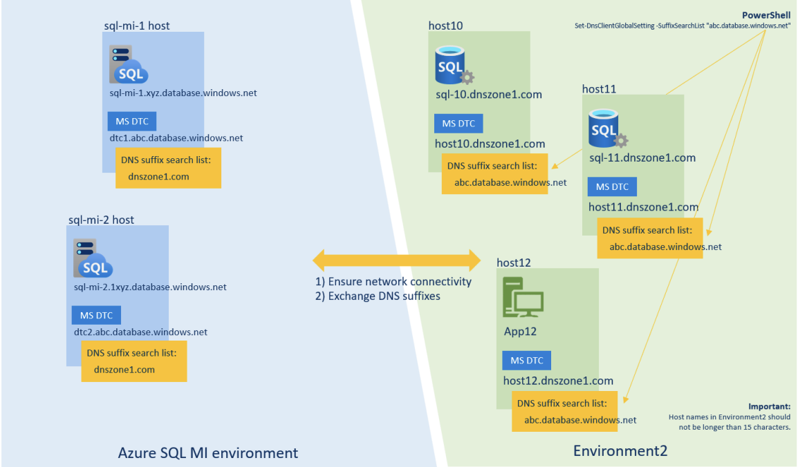
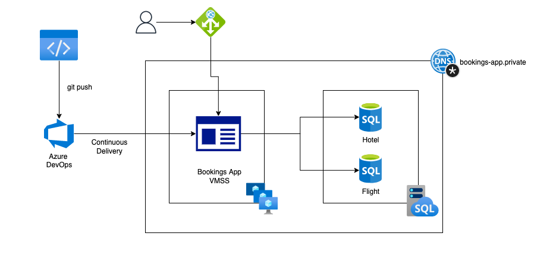
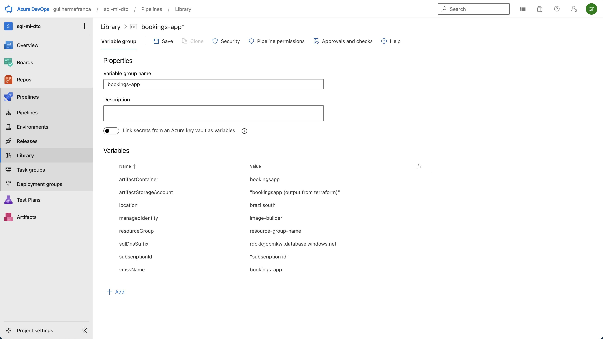
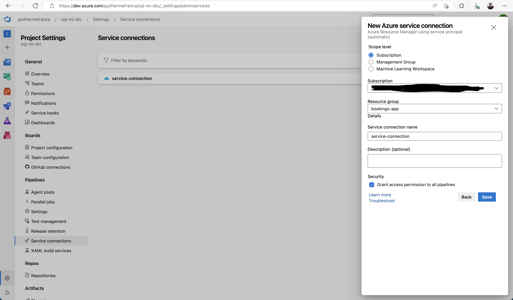
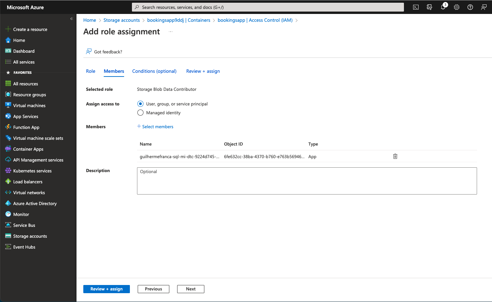
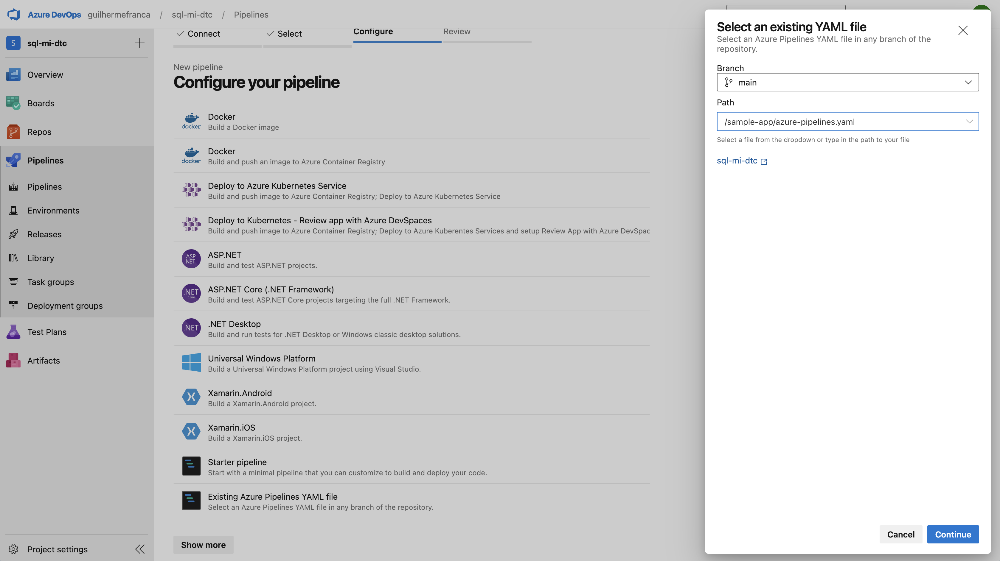
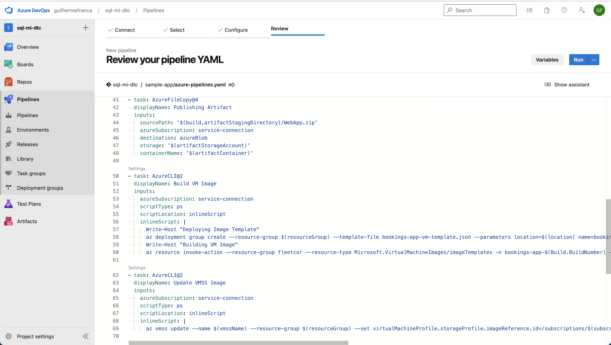

## About

 This repository showcases the use of [MSDTC](https://en.wikipedia.org/wiki/Microsoft_Distributed_Transaction_Coordinator) in an Azure
 SQL Managed Instance, that allows an application to run transactions against several databases, for scenarios where [Elastic Transactions](https://learn.microsoft.com/en-us/azure/azure-sql/database/elastic-transactions-overview?view=azuresql) are not supported.

 The sample app is a .net framework application that runs on a Virtual Machine Scale Set. It's a Flight and Hotel Booking application that spans a transaction over two SQL Databases using [System.Transactions](https://docs.microsoft.com/en-us/dotnet/api/system.transactions?view=net-6.0) (see [MakeReservation.cs](sample-app/MSDTCApp/DataAccessRepository/MakeReservation.cs)).

 __Note__: MSDTC on Managed Instance is still in private preview, for more information please check [this announcement](https://techcommunity.microsoft.com/t5/azure-sql-blog/ms-dtc-for-azure-sql-managed-instance-extending-distributed/ba-p/3576839).

 _This project assumes you already have an existing environment with a working SQL MI instance with DTC enabled and configured. Hotel and Flight Databases must be created using the provided .sql scripts._

### Architecture

This architecture uses Azure SQL Managed Instance with DTC support enabled as its database and a Virtual Machine Scale Set as its application backend.

The goal of the architeture is to minimize operational burden by using Terraform, Azure DevOps and Azure Image Builder to create [immutable VM images and infrastructure](https://learn.microsoft.com/en-us/archive/msdn-magazine/2017/october/cloud-development-building-better-cloud-deployments-5-steps-to-immutability) and deploy them in an automated way on a VMSS. That way, if a given release is not working as expected, one can simple revert the ```virtualMachineProfile.storageProfile.imageReference.id``` of the VMSS to bring the environment back to a working condition.

Network Connectivity:



Architecture: 



### Usage

Create the base infrastructure need by Azure Image Builder and Azure DevOps. 

_Take note of terraform apply output, you'll need it later._
```
$ cd terraform/
$ vi variables.tfvars # existing environment information
$ terraform init
$ terraform plan -var-file='variables.tfvars' \
-target azurerm_role_assignment.image_builder_storage \
-target azurerm_role_assignment.image_builder_container \
-target azurerm_role_assignment.image_builder_rg
$ terraform apply -var-file='variables.tfvars' \
-target azurerm_role_assignment.image_builder_storage \
-target azurerm_role_assignment.image_builder_container \
-target azurerm_role_assignment.image_builder_rg
```

[Import this project](https://learn.microsoft.com/en-us/azure/devops/repos/git/import-git-repository?view=azure-devops) into Azure DevOps and create a [variable group](https://learn.microsoft.com/en-us/azure/devops/pipelines/library/variable-groups?view=azure-devops&tabs=yaml) for the build pipeline, changing the values accordingly to your environment. 



Create a service connection named ```service-connection```.



Give ```Storage Blob Data Contributor``` permission to the service connection Service Principal on the storage account from the terraform output.



Create a build pipeline from the ```sample-app/azure-pipelines.yaml``` definition.



Run the pipeline.



_The first run will fail on the Update VMSS Image step since this resource is yet to be created._

Create the infrastructure.

```
$ vi variables.tfvars # set the vmss-image-id created by Azure Image Builder
$ terraform plan -var-file='variables.tfvars'
$ terraform apply -var-file='variables.tfvars'
```

Get the application url from terraform's output and open it in your browser.

From now on, every push to the main branch with changes to the sample-app or its vm image template will trigger the pipeline and deploy the application to the Virtual Machine Scale Set.

### Docs

https://en.wikipedia.org/wiki/Microsoft_Distributed_Transaction_Coordinator

https://learn.microsoft.com/en-us/archive/msdn-magazine/2017/october/cloud-development-building-better-cloud-deployments-5-steps-to-immutability

https://docs.microsoft.com/en-us/dotnet/api/system.transactions?view=net-6.0

https://learn.microsoft.com/en-us/azure/devops/repos/git/import-git-repository?view=azure-devops

https://learn.microsoft.com/en-us/azure/devops/pipelines/library/variable-groups?view=azure-devops&tabs=yaml

https://learn.microsoft.com/en-us/azure/virtual-machines/image-builder-overview?tabs=azure-cli